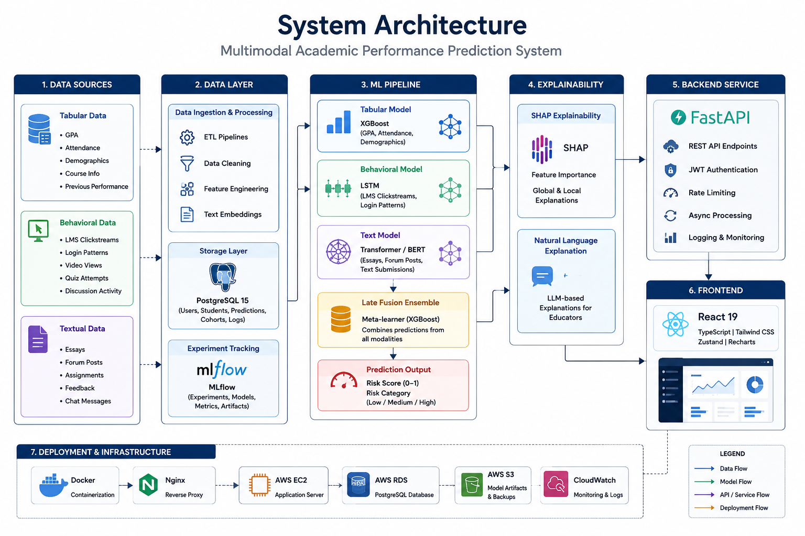

# Multimodal Student Academic Prediction

An end-to-end system for predicting student academic risk from three data sources: tabular student records, behavioral LMS activity, and free-text submissions. The backend combines modality-specific models, stores predictions, and returns explanations; the frontend presents cohort dashboards and model summaries.

## Deployment

Model backend is deployed on AWS cloud and frontend is deployed on Vercel. 

https://academic-prediction.vercel.app/login

## Objective

This project predicts student academic risk by combining three modalities: tabular records, behavioral LMS activity, and free-text submissions. The goal is to provide timely risk scores, cohort views, and model-level explainability to support interventions and analysis.

## System Architecture

The architecture diagram below illustrates how the frontend, API, datastore, and model artifacts interact. 




## Repository layout

```
.
├─ backend/
│  ├─ app/                   # FastAPI application package (routes, auth, explainability, preprocessing)
│  ├─ alembic/               # DB migration scripts
│  ├─ models/                # Model metadata artifacts used by the backend (small descriptors; large binaries kept in /models/)
│  ├─ scripts/               # init_db, seed_db, evidence generation utilities
    │  ├─ tests/                # backend unit/integration tests
    │  ├─ Dockerfile
    │  └─ requirements.txt
├─ frontend/
│  ├─ src/                   # React app (pages, components, API client, store)
│  ├─ public/                # static assets
│  ├─ package.json
│  └─ vite.config.*
├─ data/
│  ├─ raw/                   # raw CSV inputs
│  └─ processed/             # numpy arrays and processed features for models
├─ models/                   # optional: large trained model binaries (ignored by default)
├─ images/                   # screenshots and architecture diagram(s)
├─ scripts/                  # helper scripts (data generation, docs, conversions)
├─ docker-compose.yml
├─ docker-compose.prod.yml
├─ README.md
```

## Tech Stack 

| Component | Purpose |
| --- | --- |
| FastAPI | Backend API server and request routing |
| SQLAlchemy | ORM and DB models |
| Alembic | Database migrations |
| PostgreSQL (Docker) | Relational datastore (configured in docker-compose.yml) |
| PyTorch | Neural/text models |
| XGBoost / scikit-learn | Tabular models and learners |
| pandas / NumPy | Data processing and serialization |
| SHAP | Model explainability and feature importance |
| MLflow | Experiment tracking and model metadata |
| React + Vite | Frontend SPA and dev server |
| Tailwind CSS | Styling utility framework |
| Vitest | Frontend unit testing |

## Getting started

### Prerequisites

- Docker & Docker Compose
- Python 3.11+ (for local backend development)
- Node.js 18+ (frontend)

### Quickstart (recommended — Docker Compose)

1. Copy `.env.example` to `.env` at the repository root and set required secrets (for example `JWT_SECRET_KEY`).
2. Start the stack:

```bash
docker compose up -d --build
```

3. Services:

- Frontend: http://localhost (container exposes port 80)
- Backend API: http://localhost:8000 (OpenAPI docs at `/docs`)

Local backend development (Windows PowerShell)

```powershell
cd backend
python -m venv .venv
. .venv\Scripts\Activate.ps1
pip install -r requirements.txt
cp .env.example .env
alembic upgrade head
uvicorn app.main:app --reload --port 8000
```

Local frontend development

```bash
cd frontend
npm install
# On Windows PowerShell set VITE_API_BASE_URL in your environment or create a .env file
setx VITE_API_BASE_URL http://localhost:8000
npm run dev
```

Generate synthetic data (for tests / local dev)

```bash
python data/generate_synthetic.py
```

API overview (selected endpoints)

| Method | Endpoint | Auth | Purpose |
| --- | --- | --- | --- |
| GET | /health | No | Health check |
| GET | /info | No | Backend version & model metadata |
| GET | /models | No | List available models |
| POST | /auth/login | No | User login |
| POST | /predictions/predict | Yes | Create a student risk prediction |

## Testing

### Backend

```bash
cd backend
pytest
```

### Frontend

```bash
cd frontend
npm test
```

## Configuration notes

- Root `.env.example` is intended for Docker-based runs. Copy to `.env` and set secrets.
- `backend/.env.example` defines `DATABASE_URL`, `JWT_SECRET_KEY`, `MLFLOW_TRACKING_URI`, and `ENVIRONMENT`.
- `VITE_API_BASE_URL` controls the frontend API base URL in development.
- `FRONTEND_URL` (backend) should be set to the origin serving the UI for CORS and cookie settings.
